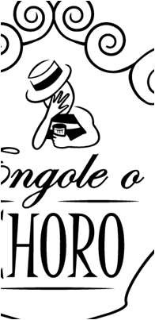

<!DOCTYPE html><!-- Declaramos que iremos usar o HTML 5 -->
<html lang="pt-br">	<!-- Inicia ciclo de Programação HTML com idioma da página em PT-BR-->
	<head>			<!-- Inicia a parte das configurações -->
		<meta charset="utf-8"><!--Este elemento define o tipo da codificação dos caracteres SEMPRE BOM COLOCAR-->
		<meta name="viewport" content="width=device-width, initial-scale=1.0"><!-- Enxerga o tamanho da tela do dispositivo-->
		<link href="https://fonts.googleapis.com/css?family=Alata|Dancing+Script&display=swap" rel="stylesheet">
		<title>LuannaGrammont_Ilustradora</title> <!-- o título da página que é exibido na barra de títulos dos navegadores -->
<!-- Criamos os estilos em CSS -->
	
</head>

	<body>

		 
		 <!-- Conteúdo das células de acordo com a área -->
			

			
			  

			          
<strong>Luanna Grammont - 
					   Ilustadora  </strong>
 <!-- -->
					  
			  

			  
			  
<strong>Trabalhos</strong> 
			   

			   
			  
<strong>Logos</strong> 
			  
  
			  
			  
 
			  <strong>Técnicas</strong>   
			  

			  
			  
<strong>Formações</strong> 
			  

			  
			  
<strong>Currículo</strong> 
			   

			   
			  

				  
 Atualizações 

				 
 28-01: Trabalhos: Ilustrações para Campanha Colégio Sistemas 

			  

			  
			  
Contato: luannagram@gmail.com

			

			
	</body>
</html>

